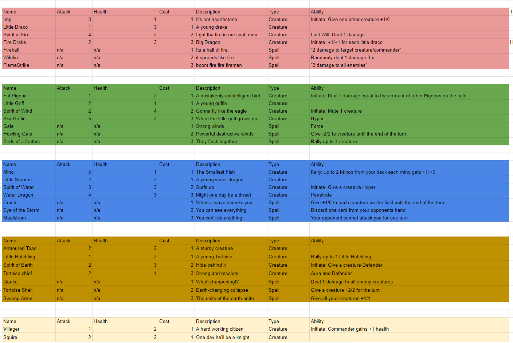
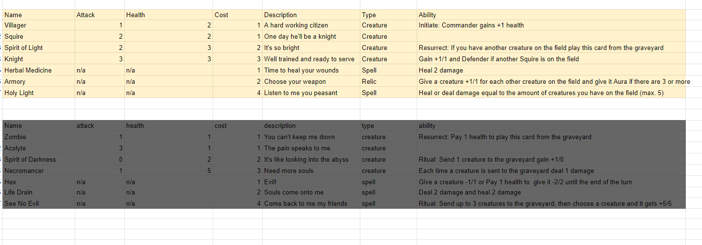

<div id="top-of-doc"></div>


# Python Card Game 

## Kinda more like 100 days of Python

[About Modules](https://stackoverflow.com/questions/714063/importing-modules-from-parent-folder) | [Card Ideas](#card-images) | [Jump to End](#end-of-doc) 

***

https://www.guru99.com/python-tutorials.html | https://www.geeksforgeeks.org/

***

Day 1 | 2/2/2022 - Wednesday - /*my dude*/

- Print statements & Variables & Operators & String Manipulation

***

Day 2 | 2/3/2022 - Thursday -

- Actually did what I said I was gunna do yesterday.

    - Read some of this - https://docs.python-guide.org/

***

Day 3 | 2/4/2022 - Friday -

- More reading and changing arithmetic operators into functions

    - https://docs.python-guide.org/writing/structure/'

    - Panagram Script from :
        - https://www.geeksforgeeks.org/pangram-checking/

    - https://docs.python.org/3/library/string.html

***

Day 4 | 2/5/2022 - Saturday -

- Forgot to do stuff. Dang, not even a week into coding and I stop for a day.

***

Day 5 | 2/6/2022 - Sunday -

- Trying to code for the rest of the night and put stuff up on my repo. **I FORGOT AGAIN.**

***

Day 6 | 2/7/2022 - Monday - 

Put up on github. Added functions for names. 

- https://www.codespeedy.com/how-to-use-a-variable-from-another-function-in-python/


- https://realpython.com/python-return-statement/#returning-vs-printing

    - If your function has multiple return statements and returning None is a valid option, then you should consider the explicit use of return None instead of relying on the Python’s default behavior.

***

**BAD PRACTICE :**

``` 
counter = 0

def increment() :
global counter
counter +=1

>>>>increment()
>>>>counter
>1

```
**GOOD PRACICE :**

 In general, it’s a good practice to avoid functions that modify global variables. If possible, try to write self-contained functions with an explicit return statement that returns a coherent and meaningful value.

 Additionally, when you need to update counter, you can do so explicitly with a call to increment(). This way, you’ll have more control over what’s happening with counter throughout your code.


```
 
counter = 0

def increment(var) :
return counter +=1

>>> increment(counter)
> 1
>>> counter
> 0
>>> counter = incrememnt(counter)
>>> counter
> 1 

```

***

Day 7 | 2/8/2022 - Tuesday - 

I was reading about variables and objects in python. Cleaned up some of the scripts more.

- https://www.codespeedy.com/how-to-use-a-variable-from-another-function-in-python/

- https://www.programiz.com/python-programming/type-conversion-and-casting

- https://www.guru99.com/calendar-in-python.html

- https://www.guru99.com/date-time-and-datetime-classes-in-python.html#4

Looking at work now. Will write more about how I started programming and self learning.

***

Day 8 | 2/9/2022 - Wednesday -

Nothing. Maybe 10 minutes reading.

***

Day 9 | 2/10/2022 - Thursday -

Nothing again. 

***

Day 10 | 2/11/2022 - Friday -

Read some articles included above(starting to move those articles around). Learning how classes and functions work. Found out python does not have a built in function to call the "name" of an object. This is because the variable for an object can change at a given time and present bugs. There are work arounds. 

- https://stackoverflow.com/questions/12189000/how-to-write-a-function-to-return-the-variable-name

- https://stackoverflow.com/questions/8875202/can-an-object-inspect-the-name-of-the-variable-its-been-assigned-to/8875313#8875313

**NOTE: About using “self” in Python**

- The self-argument refers to the object itself. Hence the use of the word self. So inside this method, self will refer to the specific instance of this object that’s being operated on.

- Self is the name preferred by convention by Pythons to indicate the first parameter of instance methods in Python. It is part of the Python syntax to access members of objects

- Python runtime will pass “self” value when you call an instance method on in instance, whether you provide it deliberately or not.

- You just have to care about the non-self arguments

```

# Example file for working with classes
class myClass():
  def method1(self):
      print("Guru99")
        
  def method2(self,someString):    
      print("Software Testing:" + someString)
  
      
def main():           
  # exercise the class methods
  c = myClass ()
  c.method1()
  c.method2(" Testing is fun")
  
if __name__== "__main__":
  main()

```

~~[Found mindmapping software.](http://freemind.sourceforge.net/wiki/index.php/Site_map)~~

[Better MindMap Software](https://gitmind.com/)

- Creating my first mind map for this card game I have been building for years now.

- [GitMind How-To](https://gitmind.com/faq/how-to-use-gitmind.html?apptype=aps-gg-en&appver=1.0.8.0&ct=1644637728&h=cff101ea9ffe94539c017c16a23a0538&language=en&mt=1644637729&app_id=459&type=install&wxga=GA1.2.1674683154.1644465849#_3-chapter)

-

***

Day 11 | 2/12/2022 - Saturday -

Working on a mind map for my card game. Including images from my spreedsheet I made when I started working on this game.

Changed the structure of my python scripts. Added images, and basic scripts folders.

- https://docs.python.org/3/reference/import.html

Added images for : [Card Ideas](#card-images)


**Side note :**

Spoiler text. Note that it's important to have a space after the summary tag. You should be able to write any markdown you want inside the `<details>` tag... just make sure you close `<details>` afterward.
  

````markdown
<details>
    <summary>Spoiler warning</summary>

Spoiler text. Note that it's important to have a space after the summary tag. You should be able to write any markdown you want inside the `<details>` tag... just make sure you close `<details>` afterward.

```javascript
    console.log("I'm a code block!");
```

</details>
````  

***

Day 12 | 2/13/2022 - Sunday -

Worked on getting global variables working. It was weird had to use stack overflow. I learned about scope in Python.

- https://stackoverflow.com/questions/10506973/can-not-increment-global-variable-from-function-in-python

- https://stackoverflow.com/questions/10588317/python-function-global-variables

- [not what i was looking for but useful info about classes](https://careerkarma.com/blog/python-missing-required-positional-argument-self/)


```
//correct usage
//
/

health = 20 # set variable

def dealDamage():
    global health # call using global keyword
    health = health - 1 
    print("damage to global health var :", health)


//function below has the big mistake (didnt say var = var - 1)
//
/

def loseHitpoint():
    global hitpoints
    hitpoints - 1
    print("damage to global hitpoints var :", hitpoints)


```

***

<div id="end-of-doc"></div>


<div id="card-images"></div>

<details>
  <summary><b>Card Idea Images</b></summary>

 {:height=250px}




  
</details>

***

- Objects

    - https://www.guru99.com/python-class-objects-object-oriented-programming-oop-s.html

- Classes

    - https://www.geeksforgeeks.org/self-in-python-class/#:~:text=self%20represents%20the%20instance%20of,to%20refer%20to%20instance%20attributes.


- Loops


***

- Timer

- Calculators

- Card Game

- 

[Jump to Top](#top-of-doc)